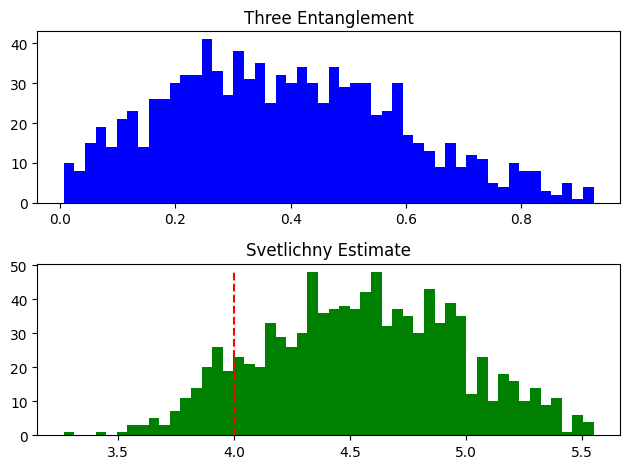
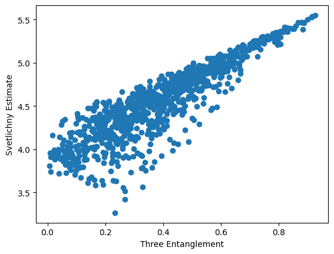
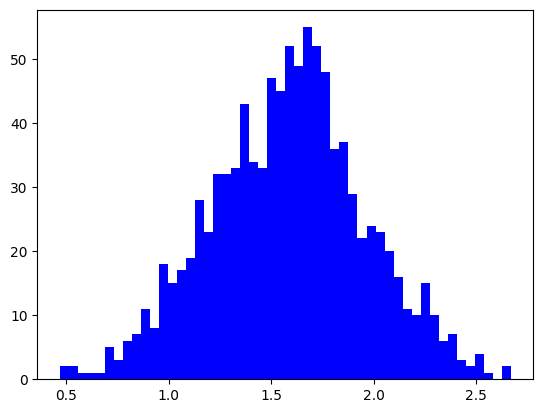

# Bell-ineq-VQE
Using VQE method to calculate Bell inequality

## Notes

- [x] 发现之前的 `rand_state` 用的随机方法是错误的，使用 `np.random.random` 只能产生 $[0, 1]$ 的随机数，应将所有未限制的随机数发生器修改为 `np.random.uniform(-1, 1, size)` 。
- [x] 重新对 pure 3-qubit 和 random 3-qubit 进行大量随机，绘制分布图，记录数据，统计结果。
    
    
- [x] 随机产生高维向量，计算向量之间的夹角 $\cos \theta = \frac{\left< x, y\right >}{\Vert x \Vert \cdot \Vert y \Vert}$ ，统计夹角的分布：
  - 随着维度 $n$ 的增大，分布越来越集中于中间，两边的分布降低
  - 对于本次实验关心的 $n=8$ ，具有特定的分布，这种分布是否会影响随机数据的随机性？是否有必要先随机产生一组正交的向量，然后产生密度矩阵？
    
- [x] 探索另一种随机生成 $\rho$ 的方法，先随机产生一组正交向量，然后生成对应的概率分布。
    结论：没什么区别，基本上统计学上没太大的区别。